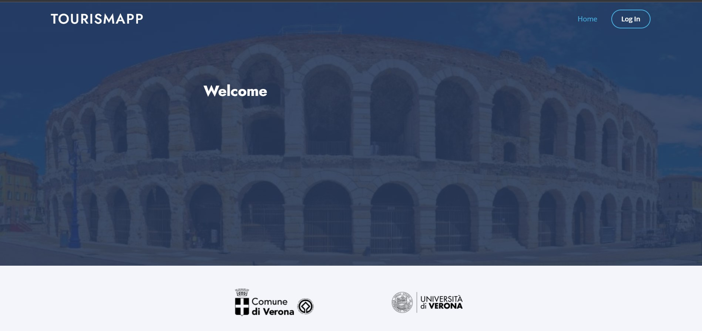
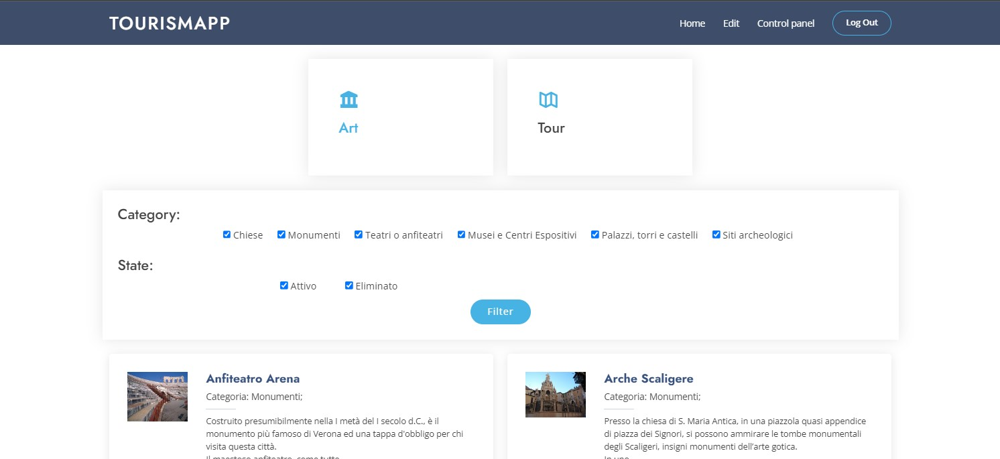
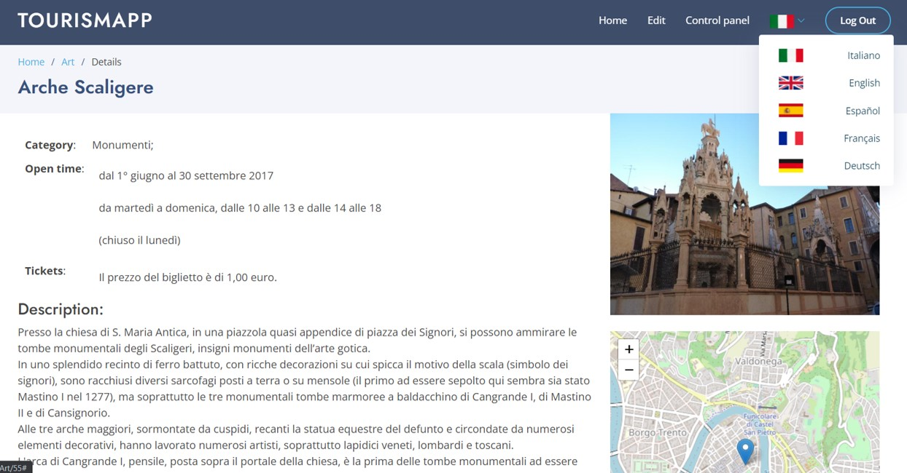

# Tourism_webApp

Il seguente repository contiene il codice sorgente di un'applicazione web ad accesso riservato sviluppata per la gestione di PoI (Point of Interest) ed itinerari della città di Verona. 
Questa applicazione è stata realizzata per il progetto *Palestre Digitali del Comune di Verona e dell'Università degli studi di Verona: Progettazione di un sistema innovativo per la gestione dei flussi turistici della città di Verona* (presentazione dell'intero progetto https://appturismogeo.comune.verona.it/).

L'applicazione web prevede l'accesso alle informazioni presenti nel database previa autenticazione. Sono presenti tre tipi di utenti:

1. **Admin** completo accesso all'intero applicativo: possibilità di visualizzazione e modifica di PoI ed itinerari, possibilità di accesso al pannello di controllo dalla quale è possibile modificare anche i permessi agli utenti
2. **Staff** utente con permessi di modifica, eliminazione e visualizzazione dei PoI ed itinerari
3. **User** utente con solo permessi di visualizzazione dei PoI e degli itinerari presenti.

## Funzionalità

#### Modifiche applicabili ai PoI:

- Cancellare un PoI esistente
- Modificarne le caratteristiche: nome, descrizione, orari apertura, costo biglietti, categoria di appartenenza, immagine, posizione geografica
- Aggiungere traduzioni. Attualmente Inglese, Francese, Spagnolo, Tedesco sono le alternative presenti

#### Modifiche possibili ad un itinerario:

- Modificarne le caratteristiche: nome, descrizione, durata, tipologia, immagine
- Modificare dei PoI che vanno a comporre un itinerario: cancellazione, aggiunta, scambi, sostituzioni
- Aggiungere traduzioni. Attualmente Inglese, Francese, Spagnolo, Tedesco sono le alternative presenti

#### Visualizzazione:

Sia per quanto riguarda i PoI che gli itinerari è possibile eseguire la visualizzazione con dei filtri. Per quanto riguarda i PoI è possibile filtrare in base allo stato e alla categoria; per gli itinerari, invece, è possibile filtrare in base al tipo. E\' inoltre possibile visualizzare nel dettaglio ogni PoI ed ogni itinerario.

         

## Autrice

**Anna Dalla Vecchia** - [4nnina](https://github.com/4nnina)
